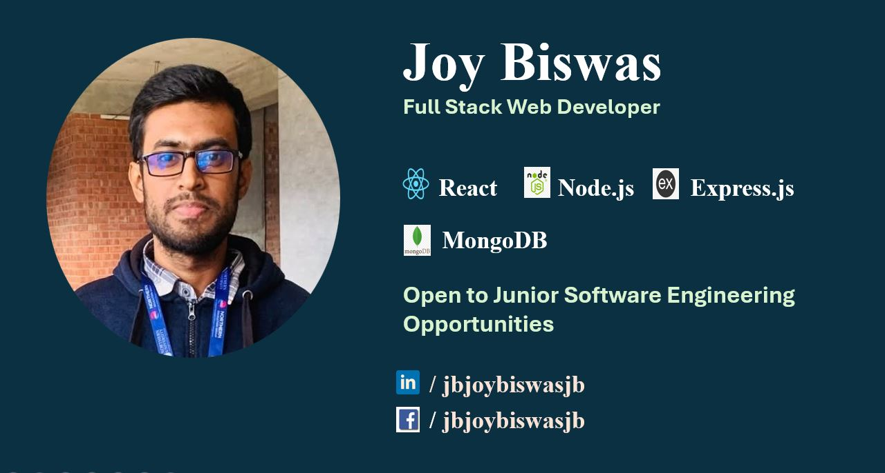

<!-- banner image starts here  -->

<!-- banner image ends here  -->

<h1 align="center">Hi 👋, I'm Joy Biswas</h1>
<h3 align="center">A passionate Full Stack Web Developer from Bangladesh</h3>

<!-- about-me section starts here  -->

### 👨‍🏫 &nbsp; About Me

  
Hi, I'm **Joy Biswas**, a CSE student and aspiring software engineer passionate about building modern, responsive, and user-friendly web applications.
  
💻 I work with **JavaScript, React, Next.js, Node.js, Express.js, and MongoDB** and enjoy turning ideas into functional web applications.

🚀 Currently, I'm focused on improving my **full-stack development, problem-solving, and software engineering skills** by building real-world projects.

🌱 I'm also exploring **Python, Data Science, and Machine Learning** as part of my long-term learning journey.

🎯 **Goal:** To start my career as a **Junior Software Engineer / Full-Stack Web Developer** and continuously grow as a software engineer.

🤝 I'm open to **junior and entry-level software development opportunities**.

 
<!-- about-me section ends here  -->

- 💬 Ask me about **React, Next.js, Node.js, Express.js, MongoDB**

- 📫 How to reach me **jbjoybiswasjb@gmail.com**

<h3 align="left">Connect with me:</h3>

<h3 align="left">Languages and Tools:</h3>

             

&nbsp;

